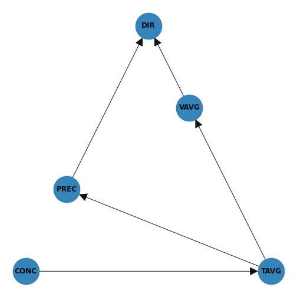

# Pollen
[](https://colab.research.google.com/github/CrisSherban/Pollen/blob/master/src/network.ipynb)

## Table of Contents

* [About the Project](#about-the-project)
* [Prerequisites](#prerequisites)
* [Installation](#installation)
* [Usage](#usage)
* [Results](#results)
* [Authors](#authors)
* [Acknowledgments](#acknowledgments)

## About The Project

```Pollen``` is a project that aims at finding and understanding how pollen concentration is affected by weather. The
main idea stands in the usage of Bayesian Networks that effectively explain out the relationships in the model. The
dataset used is built thanks to information gathered from different sources such as
[POLLNET](http://www.pollnet.it/default_it.asp)
and [ilMeteo](https://www.ilmeteo.it/portale/archivio-meteo) for the city of Florence, Italy. In particular the
following attributes are taken into consideration:

* Wind
* Wind Direction
* Temperature
* Pollen Concentration
* Precipitations

Check more in the Report [HERE](/Report.pdf).

## Prerequisites

To get a local copy up and running follow these simple steps.

The project provides a ```Pipfile``` file that can be managed with [pipenv](https://github.com/pypa/pipenv).  
```pipenv``` installation is **strongly encouraged** in order to avoid dependency/reproducibility problems.

* pipenv

```sh
pip install pipenv
```

## Installation

1. Clone the repo

```sh
git clone https://github.com/CrisSherban/Pollen
```

2. Enter in the project directory and install Python dependencies

```sh
cd Pollen
pipenv install
```

## Usage

Here's a brief description of the files and a directory tree:
<pre>
* datasets      (directory for datasets ) 
* out           (directory containing output graphs )
* resources     (directory containing partial datasets and original files)
* src
    * creates_dataset.py: creates dataset from files in resources directory.
    * get_pol.py: selenium scraper that downloads pollen concentration from Pollnet.
    * network.ipynb: main file with documented outputs.
</pre>    

Output Network:

<p align='center'>
  
</p>

## Results

We can appreciate that we can now understand from the model that mid/high temperature is linked with an incresed
concentration of grass pollen.

<p align='center'>
  
</p>

## Authors

* [**Serban Cristian Tudosie**](https://github.com/CrisSherban)

## Acknowledgments

FAIKR-3 © Course held by Professor [Paolo Torroni](https://scholar.google.com/citations?user=uOZZjwsAAAAJ&hl=en)
